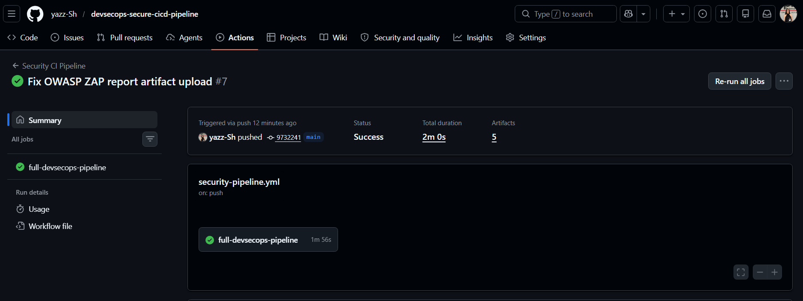
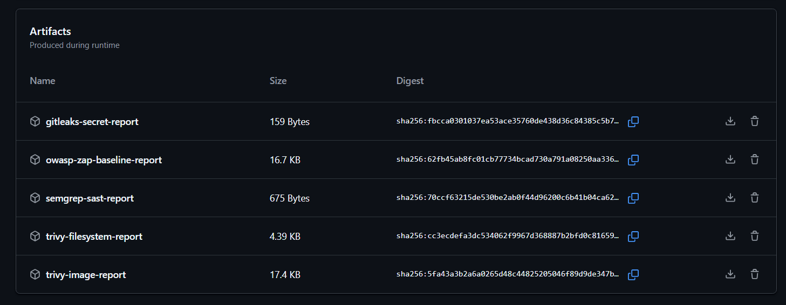
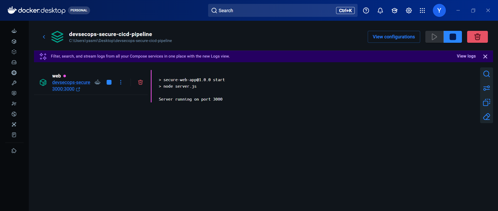
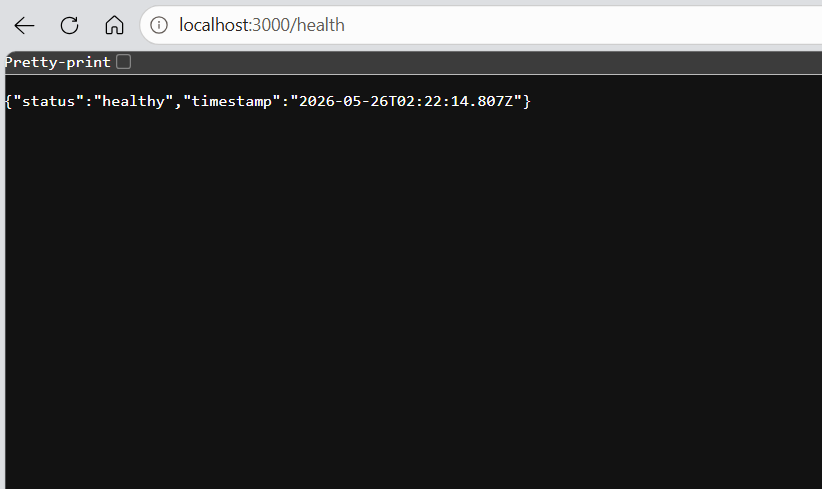

# Secure CI/CD Pipeline for a Web Application


## Project Overview

This project is a hands-on DevSecOps lab focused on integrating security checks directly into a CI/CD pipeline.

The objective is to secure a simple Node.js web application by automating testing, containerization, static analysis, secret detection, vulnerability scanning, Docker image scanning and basic dynamic application security testing.

This project demonstrates how security can be shifted left and integrated into the software delivery workflow instead of being treated as a final manual step.

## Tech Stack

| Category | Tools |
|---|---|
| Application | Node.js, Express.js, Helmet |
| Containerization | Docker, Docker Compose |
| CI/CD | GitHub Actions |
| Testing | Node.js Test Runner, Supertest |
| SAST | Semgrep |
| Secret Detection | Gitleaks |
| Vulnerability Scanning | Trivy |
| DAST | OWASP ZAP Baseline Scan |

## Application Endpoints

| Method | Endpoint | Description |
|---|---|---|
| GET | `/` | Main API response |
| GET | `/health` | Health check endpoint |
| GET | `/users` | Demo users endpoint |
| POST | `/login` | Demo login endpoint |

## CI/CD Pipeline

The GitHub Actions workflow runs automatically on every push to the `main` branch and on pull requests.

Pipeline stages:

1. Install dependencies
2. Run automated API tests
3. Run Semgrep SAST scan
4. Run Gitleaks secret detection
5. Run Trivy filesystem vulnerability scan
6. Build Docker image
7. Run Trivy Docker image vulnerability scan
8. Start the application container
9. Run OWASP ZAP baseline DAST scan
10. Upload all security reports as GitHub Actions artifacts

## Security Controls Implemented

| Security Control | Tool | Purpose |
|---|---|---|
| Static code analysis | Semgrep | Detect insecure coding patterns |
| Secret detection | Gitleaks | Detect exposed secrets, API keys, tokens and credentials |
| Filesystem vulnerability scan | Trivy | Detect dependency and filesystem vulnerabilities |
| Docker image vulnerability scan | Trivy | Detect vulnerabilities inside the container image |
| Dynamic application security testing | OWASP ZAP | Test the running application from an external perspective |

## Generated Security Reports

Each workflow run generates and uploads the following reports as artifacts:

| Report | Tool | Format |
|---|---|---|
| SAST report | Semgrep | JSON |
| Secret detection report | Gitleaks | JSON |
| Filesystem vulnerability report | Trivy | JSON |
| Docker image vulnerability report | Trivy | JSON |
| DAST baseline report | OWASP ZAP | HTML + JSON |

## Screenshots

### GitHub Actions Pipeline Success



### Generated Security Reports



### Docker Container Running



### Health Endpoint



## Run Locally

```bash
cd app
npm install
npm start
```

Application URL:

```text
http://localhost:3000
```

Health check:

```text
http://localhost:3000/health
```

## Run with Docker

```bash
docker compose up --build
```

Stop the containers:

```bash
docker compose down
```

## Project Structure

```text
devsecops-secure-cicd-pipeline/
├── app/
│   ├── package.json
│   ├── package-lock.json
│   ├── server.js
│   └── server.test.js
├── .github/
│   └── workflows/
│       └── security-pipeline.yml
├── screenshots/
│   ├── github-actions-success.png
│   ├── pipeline-artifacts.png
│   ├── docker-container-running.png
│   └── health-endpoint.png
├── reports/
├── Dockerfile
├── docker-compose.yml
├── .gitignore
├── LICENSE
└── README.md
```

## What I Learned

Through this project, I practiced:

- Building a basic Node.js API
- Writing automated API tests
- Containerizing an application with Docker
- Creating a GitHub Actions CI/CD pipeline
- Running SAST with Semgrep
- Detecting committed secrets with Gitleaks
- Scanning dependencies and Docker images with Trivy
- Running a basic DAST scan with OWASP ZAP
- Uploading security reports as GitHub Actions artifacts

## Next Improvements

Planned improvements:

- Add security gates for high and critical vulnerabilities
- Fail the pipeline when secrets are detected
- Add SARIF reports to GitHub Security tab
- Add SBOM generation
- Add Kubernetes deployment manifests
- Add Infrastructure as Code scanning
- Add cloud deployment with security checks

## Skills Demonstrated

DevSecOps | CI/CD Security | Application Security | Docker Security | Vulnerability Scanning | Secret Detection | SAST | DAST | GitHub Actions
